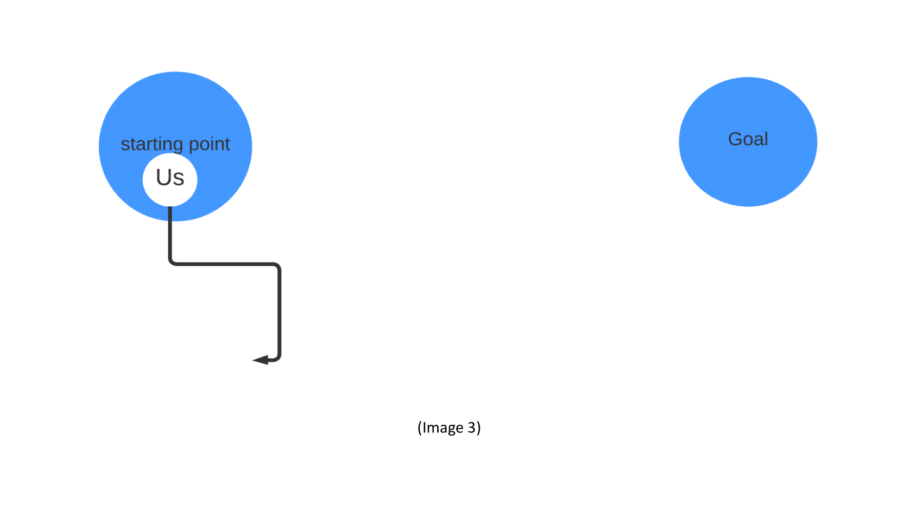

# Better Together: The First Journey

**I. Introduction**

Have you ever felt tired and alone inside the dark clouds of your life and career? 
You feel like a storm is going to sweep you out the circle of 
your life and make you bend your knee? Don't worry, 
you are not alone in this journey, go with me and together we will become better with 5 steps.
“Better Together” is a life motto. It is not only "the secret" to working and studying better,
but also a lifestyle, 
a guiding star that leads us to a happier and more beautiful life.
 
 
**II. Story**

So let’s begin with my story:

Story 1: Computer, tell me what can you see?

I am taking a course in Coursera with instructor Andrew Ng.
He is one of the best teachers I have ever had. 
He is my inspiration. He always shares his experiences with love and sincerely. 
He always thanks us for spending time learning with him, even though 
he is the one who objectively shares precious experiences to the one who needs it. 
He helps me understand, do complex and abstract things step by step in a practical 
way that makes learning so fun. 
Then there was a day, I learned how computers classify an image is a cat or a dog and 
it worked like this:
- First, we need to define what is the _**main character**_ in this challenge? It is image of cats and dogs. 
- Computers don't have a human brain which is very good at processing images. So how can a computer understand images to know a cat or a dog? Is there any way to _**teach**_ a computer? One of the ways is to use an artificial neural network which is stimulated based on the way our brains work. 
- So to conquer this challenge, let’s start building a model using artificial neural network structure.
- Then evaluate  if it is  good or not by some standards.
- And then update, build again to become better.

Story 2: Yes or “yes”

Another story is: I’m tutoring a high school student. Her name is Nguyen Ngoc Bao Han - a very beautiful name. She is smart, approachable and so energetic. She inspires me to think deeper so I can explain abstract math concepts in easier ways, so she and we can become BETTER TOGETHER. There was a day when I taught her a new concept, she got confused between the perpendicular bisector and the median line. But when I asked: “Do you get it?”, she languidly said “yes”. So how can I explain it to her:

- Ok, I need to show the difference between the perpendicular bisector and median line. I will do that by teaching her what makes a line become the perpendicular bisector of a line.
- I show her that a line becoming a perpendicular bisector of the line segment AB needs to satisfy two conditions: 

 	- That line needs to _**cross the middle point**_ of the line segment AB.
    
    - That line needs to be _**perpendicular**_ to the line segment AB .
- Then she did some  examples  with two key points that I highlighted in the solution above .
- When she’s done, we review together. 
- Then, I will modify what was presented about that example to make it easier to understand. She did again in detail then we completed together until she truly YES with joy.       

 

**III. Model**

So what you can see in two stories  above is to achieve a goal it is a process of 5 steps:

Step 1: define the problem.

Step 2: find a solution.

Step 3: do it, practice it.

Step 4: take a review, like is that correct or what is the score in scale 10, what needs to improve.

Step 5: update from the review and do it again.

This is the process:

 Image 1 - Process 

		
Okay, it sounds make sense but you will wonder: how can we do it effectively and become BETTER TOGETHER?

So what we need to do:

in the first step (define the problem): you, me, we need to define it RIGHT.

In the second step (find a solution): you, me, we need to find a PRACTICAL solution.

In the third step (do it): you, me, we need to HARDWORKING.

In the fourth step (review): you, me, we need to NETWORKING. There is a famous quote: "All models are wrong. Some are useful". In life, no judgment is completely true, it can only be appropriate in different circumstances. When we are alone, we can expect only one subjective perspective. The laws of the world always operate according to the majority. Therefore, sometimes a person's judgment and thinking is not always accurate or comprehensive with respect to all aspects of an issue. However, by combining different opinions and perspectives, we can better understand the issue, and make more accurate decisions. So to do this, you need to have at least one friend and BETTER when there are many people with POSITIVE energy review together. When you do, you and your companions TOGETHER will see many things that NEED and CAN develop. For example, the knowledge that you, they are vague or do not understand too well and how you, they explain to each other. And what I think is good when doing that is TOGETHER is more FUN. 

In the fifth step (update): you, me, we need to LISTEN to the reviews, then do it again to see how it goes. 

And do you recognize some things?

Again, it is a process of 5 steps:

Problem:  Do the process effectively. 

Solution:   Is above.

And then: Do ⟶ Review ⟶ Update.

This how it looks like:

**IV. Apply model to real life and my life**

Example1: How to become bilingual.

Problem:  Need to be good at a new language.

Solution: Find a course about the language you want to learn with a lot of student’s enrollment and high star ratings, then ask your close friends to learn with you.

Do:        Learn the course, practice with your friends.

Review:    Your friends and you, remember REVIEW INCLUDE YOU.

Update:    Listen to your friend’s feedback and practice what you need to improve.

But do you think about a scenario where you don’t have some close friends yet. What should you do? So again:
 
 
 
Example 2: How to have close friends.

Problem:  Need to have close friends.

Solution: Find a course about socializing , networking with a lot of student’s enrollment and high star ratings. First impressions are important in communication and are often formed based on appearance. An attractive appearance is the best way to make an impression on the first meeting. To express your personal style, you need to take care of your body with a healthy and beautiful physique. At the same time, choosing a fit hairstyle and fashion style will help emphasize your own advantages. Be open to people, try putting yourself in their shoes and think about what they need or want to hear. When someone asks, "Am I silly?" often they don't really want to hear a yes or no answer, but perhaps a word of encouragement. The best feedback is hardly about how to be smart or have a good day. It is more about to know yourself, others and the current situation FIRST and then how to make the best out of yourself and others to get where you all want to be.

“_Eyes shine the light, voice warm the soul and smile melt the frost can make my day_”. 

Do: 	 Learn the course and actively associate with friends  . 

Review:  Friends in your class and YOU.

Update:  Listen to their response, their emotions, their opinions. Then practice, do it again.

So I think you can see why NETWORKING is so important and we need it to become a BETTER version of ourselves TOGETHER.

And there is a question I usually ask my close friends when I talk with them, that is “IF I NEED TO CHANGE ONE THING, WHAT IS IT?”. I have this question when I read “How to be a power connector” (author: Judy Robinett – the best speaker I have ever heard). Sometimes, you may get some answers but unfortunately, I do not. But that UNFORTUNATELY led to my LUCKILY, I HAVE THE FIRST TIME REVIEW MYSELF TRULY BY MYSELF ABOUT WHAT I HAVE DONE. And that is the key reason why I started writing this story. Finally I figured out the answers. And my problem is that I am too SUBJECTIVE. I do, then I rarely take reviews so I do not  UPDATE to become BETTER and also can not BETTER TOGETHER with people around me. It is like: **_My goal_** is to finish the 100 meters race in 20 seconds to be the first person to cross the finish line. I ran with all my force in 15 seconds and stopped. I **_chilled_**, I **_slept_**, then I was **_late_**. I think I have finished but when the race was over, I only ran 80m. I do a pretty good job at the beginning but why I stop, is because I am too subjective and tired. I just ran **_alone_** in that race but no one forced me to run alone. I can have my teammates run with me and my friends - the audience who encourage me to continue. When I go alone, I have many doubts about myself like I do not know do I run in the right way, why when I go further it just gets darker and darker. And there is a light shine my way, that is from my best friends. He asks me to hang out. When we play, we go cafe, we eat, he sees the sadness and tiredness in my eyes and he said: “How are you doing, my buddy, is there anything new, you look so tired”. I shared with him about my problem, then he smiled and said: “**_I believe you are doing great, I always believe in you so you need to believe in yourself and why don’t do that with some people who are awesome like me :))_**”. That compliment and advice shine my light. I **_continue_** to run with confidence, with more teammates around who can support each other and audiences who can encourage me. That's how I **_achieve_** my goal.

And do you ever run in the WRONG WAY? I do :)). I do that when I and two of my friends do a project on a subject, which was teached by a teacher who gave us so many enjoyable lessons. He gave us a topic: **An application of Math in real life**. And we choose the prisoner's dilemma. It’s really fun and applies to so many fields based on math, especially in psychology. So what we do is all about **psychology** in real life without **giving any data about math**. At that point, my teams are all the best talented people in my class. The first member, she studied in a gifted high school and achieved many awards in Maths. The way she explains, teaches us about math theory is so energetic and passionate. The second member is a co-leader in our school social media page, she designs beautiful powerpoint for presentation, well-structured google docs for us to edit and spectacular latex for the report. And me, I am the one who will control the flow, handle when we conflict in opinions. I listen to their opinions, gently say my opinion when they finish, then ask other member’s opinions and _**do not force them say wrong to prove I am right**_, give them time to think and do in a better way. I strongly believe that we are doing great and we take our FIRST REVIEW before the presentation just 3 HOURS. So no one of us can see that we are going in the wrong ways. And what happens will happen, our presentation is a disaster, everything falls apart, it is like a cacophony that makes the audience listen in confusion. 

It is like we went like this:

 Image 3 - Beginning 

			   	
Luckily, because my team listens and answers a lot of questions that my teacher asks when teaching so he remembers us, likes us. And we volunteer to be the first group present so he gives us a second chance. At that _**second chance**_, in 8 weeks, every week we REVIEW at least a time and work so hard. When we finish our presentation, the audiences give us a big round of applause and a big round of applause again after our teacher’s compliment. 

At the second chance, we went like this:

 Image 4 - Second chance 

That’s why I think me, you, we should take a review and I take a review about myself in the day I said from the beginning. And the idea, the answer I have is after I teach Bao Han and think about the model I learn in the course taught by Andrew. The day I did this story was so great. It was sunny, I had a test, I nailed it,  I reviewed my friend's science poster and understood clearer about a machine learning model that we have learned by reviewing TOGETHER and my health is recovering quickly.

There are some tips I want to share with you after I apply this model to have a better result at my school. 

When I do a school project in groups, **_when we finish the project before the deadlines two or three weeks, I send it to my teacher and ask for a review_**. Because your teacher can give you so many things to make your products better and so do me, my group members, we become BETTER TOGETHER. So if you have some people who are good at the things you are working on, ask their review is so fantastic but again how can you know them, close to them. It is NETWORKING.

And so does the internship program. You have a problem and solution from your mentors. Ask them carefully, don't be scared if you don’t understand so you can define RIGHT problem and key points in the solution your mentors give you. You do it, then report to your mentors _**before the deadlines two to three**_ _**weeks so your mentor can give you a review**_. _**When doing that , I believe you can show  you are seriously learning, hardworking and responsible**_. 

_**So after REVIEW MYSELF and write this story, I use this model more often now with people around me to BECOME BETTER TOGETHER EVERYDAY. And I think you, we did it before but maybe just without notice.**_
 
 
**V. Review my model**

So I want to build a model that can  help us have a specific path to achieve our dreams. To do that, first my model and my first layer (Image 2) need to be accurate. And to do that, I need you. I, you, we TOGETHER can make my model become BETTER. I think my model is just like a seed right now and that seed needs to sprout, have stems, have branches, have leaves. So let’s plant the first seed and then TOGETHER grow a tree BETTER with  each of the branches is a dream in different fields with fresh, positive energy.

Don’t hesitate to contact me because I also need to:
							    
DO LISTEN UPDATE to become BETTER when REVIEW TOGETHER. 
							    
And,
							    
 IT’S ALWAYS BETTER WHEN WE’RE TOGETHER.

Contact me at:  
							    
• Github - https://github.com/quanly01 
							    
• Facebook - https://www.facebook.com/goodnight2k2/
							    
• Instagram - https://www.instagram.com/chidzung_ql/
							    
• Twitter - https://twitter.com/chidungql       
							    
• Github - https://github.com/quanly01
							    
• LinkedIn - https://www.linkedin.com/in/d%C5%A9ng-nguy%E1%BB%85n-8b92b8200/
							    
• Gmail - alwaysbettertogether2023@gmail.com     

The last thing I want to say is:

Thanks to my lovely mum (Quach Thi Ha), my patient dad (Nguyen Chi Que), my younger brother (Nguyen Duc Lam), my best friend (Tran Quang Khoi), my mentors (Quach Thi Thu Thuy, Nguyen Xuan Long. Nguyen Binh Minh), my inspirations(Andrew Ng, Nguyen Ngoc Bao Han, Judy Robinett), my brother in arms (Dinh Tien Dung), my partners (Nguyen Thi Khanh Linh, Nguyen Hoang Giang, Tran Thi Nhu Quynh), my teachers (Nguyen Thi Hong Minh, Nguyen Ngoc Phan, Le Hoang Son), my relatives (Nguyen Phuong Nguyen, Quach An Khanh, Thuc Nguyen, Lily Nguyen, Nguyen Minh Anh, Quach Thi Thanh An, Bui Quynh Huong), all of my friends and all people around me make my 21 years experienced so grateful. 

I hope you had a happy journey when we are going together. Hope you have more positive energy to embark on new journeys with the one you trust, as well as with new friends to become better and more fun together in these adventures. Thank you for going with me on this journey. Thank you for spending time on my story.

We have probably gone through quite a range of emotions in this first journey. But I think the process of developing and awakening the giant within will always continue with challenge and success. That brings us together.

If you find my story inspire you and have some feedback or stories would like to share, please write it for me. I look forward to hearing from you. 

I love you guys!
      Dũng

Link this journey:

• Github - https://github.com/quanly01/better-together
							    
• Facebook -
							    
• Instagram -
							    
• Twitter -
							    
• LinkedIn -
							    
• Spotify - 
							    
• Youtube -
							    
• Tiktok - 

